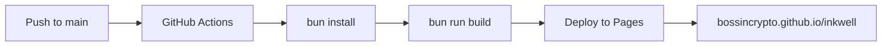

<div align="center">

# ✒️ Inkwell

**A refined Markdown studio built for writers, engineers, and thinkers.**

[](LICENSE)
[](https://react.dev)
[](https://typescriptlang.org)
[](https://tailwindcss.com)

[**Live Demo**](https://bossincrypto.github.io/inkwell/) · [Report Bug](https://github.com/BOSSincrypto/inkwell/issues) · [Request Feature](https://github.com/BOSSincrypto/inkwell/issues)

</div>

---

## Why Inkwell?

Most markdown editors are either too simple or too cluttered. Inkwell strikes the balance: a clean, split-pane editor with real-time preview, deep formatting support, and a command palette -- all running entirely in your browser with zero backend.

## Features

| Category | What you get |
|---|---|
| **Editor** | Live split/preview modes, syntax highlighting (100+ languages), find & replace, undo/redo, focus mode |
| **Markdown** | GFM tables, task lists, footnotes, emoji shortcodes, auto-save to localStorage |
| **Math** | Inline `$E=mc^2$` and block `$$...$$` rendering via KaTeX |
| **Diagrams** | Mermaid flowcharts, sequence diagrams, and more -- rendered in-browser |
| **Export** | Download as `.md`, `.html`, or print to `.pdf` |
| **Sharing** | Generate a compressed URL hash to share documents without a server |
| **Templates** | 7 built-in templates: Meeting Notes, Blog Post, README, Journal, Technical Spec, Math Notes, Diagrams |
| **Snapshots** | Version your documents with named snapshots (up to 50) |
| **Navigation** | Clickable outline sidebar, heading search, command palette (`Ctrl/⌘ + P`) |
| **Themes** | Dark and light mode with a single click |
| **Word Goals** | Set a daily word count target with a progress ring |

## Quick Start

```bash
# Clone
git clone https://github.com/BOSSincrypto/inkwell.git
cd inkwell

# Install (bun recommended)
bun install

# Dev server
bun run dev

# Production build
bun run build
```

Open [http://localhost:5173](http://localhost:5173) and start writing.

## Keyboard Shortcuts

| Action | Shortcut |
|---|---|
| Command palette | `⌘ P` |
| Bold | `⌘ B` |
| Italic | `⌘ I` |
| Insert link | `⌘ K` |
| Find & Replace | `⌘ F` |
| Focus mode | `⌘ .` |
| Undo / Redo | `⌘ Z` / `⇧ ⌘ Z` |
| Save snapshot | `⇧ ⌘ S` |
| Keyboard shortcuts | `?` |

## Tech Stack

- **React 19** + **TanStack Start** (SSR-ready)
- **Tailwind CSS 4** with oklch design tokens
- **shadcn/ui** (New York style) + Radix primitives
- **Vite 8** for blazing-fast HMR
- **Bun** for package management
- **TypeScript 5.8** strict mode

## Deployment

The project deploys automatically to **GitHub Pages** via GitHub Actions on every push to `main` or release publish.



## License

[MIT](LICENSE) -- use it however you like.

---

<div align="center">

**Topics:** `#markdown` `#editor` `#react` `#typescript` `#tailwindcss` `#open-source` `#developer-tools` `#productivity` `#kaTeX` `#mermaid` `#WYSIWYG` `#client-side`

</div>
